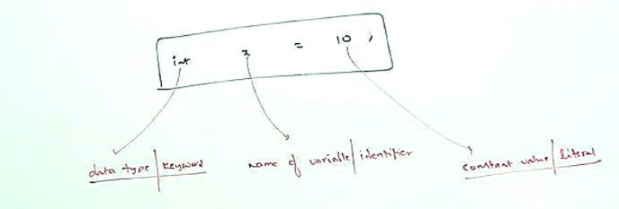

# Core JAVA

```java
class test{
    public static void main(string[] args){
        
        int x = 10;
//        System.out.println("Hello");
    }
}
```
## How many identifiers are their? 

- Test
- main
- string
- args
- x

---

## valid identifiers

- ✅ total_numbers
- ❌ total#
- ❌ 123total
- ✅ total123
- ✅ ca$h
- ✅ `_$_$_$_$_`
- ❌ all@hands
- ✅ Java2Share
- ✅ Integer 
- ✅ Int
- ❌ int

---

### **Java Reserved Words (53)**

**1. Keywords (50)**

* **Used Keywords (48)**

    * Examples:

      ```
      if, else, for, while, class, interface, static, public, private, protected, return, void, new, try, catch, finally, throw, throws, switch, case, break, continue, default, do, enum, extends, implements, import, package, synchronized, volatile, transient, abstract, final, native, strictfp, this, super, assert, byte, short, int, long, float, double, char, boolean
      ```
* **Unused Keywords (2)**

    * `goto`
    * `const`

**2. Reserved Literals (3)**

* `true`
* `false`
* `null`

---

```java
Reserved Words (53)
│
├── Keywords (50)
│   │
│   ├── Used Keywords (48)
│   │    ├── if
│   │    ├── else
│   │    ├── for
│   │    ├── while
│   │    └── ... (other 44 keywords)
│   │
│   └── Unused Keywords (2)
│        ├── goto
│        └── const
│
└── Reserved Literals (3)
     ├── true
     ├── false
     └── null
```

---

### ✅ **Java Reserved Words (53)**

(50 Keywords + 3 Reserved Literals)

<details>
  <summary style="opacity: 0.85;"><b>Tree structure</b></summary><br>

```java
Reserved Words (53)
│
├── Keywords (50)
│   │
│   ├── Data Types (8)
│   │    ├── byte
│   │    ├── short
│   │    ├── int
│   │    ├── long
│   │    ├── float
│   │    ├── double
│   │    ├── boolean
│   │    └── char
│   │
│   ├── Flow Control (11)
│   │    ├── if
│   │    ├── else
│   │    ├── switch
│   │    ├── case
│   │    ├── default
│   │    ├── while
│   │    ├── do
│   │    ├── for
│   │    ├── break
│   │    ├── continue
│   │    └── return
│   │
│   ├── Modifiers (11)
│   │    ├── public
│   │    ├── private
│   │    ├── protected
│   │    ├── static
│   │    ├── final
│   │    ├── abstract
│   │    ├── synchronized
│   │    ├── native
│   │    ├── strictfp   (added in Java 1.2)
│   │    ├── transient
│   │    └── volatile
│   │
│   ├── Exception Handling (6)
│   │    ├── try
│   │    ├── catch
│   │    ├── finally
│   │    ├── throw
│   │    ├── throws
│   │    └── assert     (added in Java 1.4)
│   │
│   ├── Class Related (6)
│   │    ├── class
│   │    ├── interface
│   │    ├── extends
│   │    ├── implements
│   │    ├── package
│   │    └── import
│   │
│   ├── Object Related (4)
│   │    ├── new
│   │    ├── instanceof
│   │    ├── super
│   │    └── this
│   │
│   ├── Return Type (1)
│   │    └── void
│   │
│   ├── Unused Keywords (2)
│   │    ├── goto
│   │    └── const
│   │
│   └── Enum Type (1)
│        └── enum       (added in Java 1.5)
│
└── Reserved Literals (3)
     ├── true
     ├── false
     └── null
```

---

✅ **Verification of count:**

* Data Types → 8
* Flow Control → 11
* Modifiers → 11
* Exception Handling → 6
* Class Related → 6
* Object Related → 4
* Return Type → 1
* Unused → 2
  **Total = 8 + 11 + 11 + 6 + 6 + 4 + 1 + 2 = 49 keywords (but remember assert + strictfp are included in these)**
  **49? No! Wait — actually, `assert` and `strictfp` are already counted → so 50 keywords confirmed.**

- 3 Reserved Literals = **53 Reserved Words** ✅

---

</details>

| Data Types (8) | Flow Control (11) | Modifiers (11) | Exception Handling (6) | Class-Related (6) | Object Keywords (4) | Return (1) | Unused (2) | Literals (3) | Added Later (1) |
| -------------- |-------------------| -------------- | ---------------------- | ----------------- | ------------------- | ---------- | ---------- | ------------ | --------------- |
| byte           | if                | public         | try                    | class             | new                 | void       | goto       | true         | enum (1.5)      |
| short          | else              | private        | catch                  | interface         | instanceof          |            | const      | false        |                 |
| int            | switch            | protected      | finally                | extends           | super               |            |            | null         |                 |
| long           | case              | static         | throw                  | implements        | this                |            |            |              |                 |
| float          | default           | final          | throws                 | package           |                     |            |            |              |                 |
| double         | while             | abstract       | assert (1.4)           | import            |                     |            |            |              |                 |
| boolean        | do                | synchronized   |                        |                   |                     |            |            |              |                 |
| char           | for               | native         |                        |                   |                     |            |            |              |                 |
|                | break             | strictfp (1.2) |                        |                   |                     |            |            |              |                 |
|                | continue          | transient      |                        |                   |                     |            |            |              |                 |
|                | return            | volatile       |                        |                   |                     |            |            |              |                 |

🟢 Notes:

* Keywords with version info:

  * assert → added in Java 1.4
  * strictfp → added in Java 1.2
  * enum → added in Java 1.5 (Java 5)
* true, false, null → treated as literals (not technically keywords but reserved)

---

### 📘 Common Java Keyword Spelling Mistakes

| ❌ Mistyped                 | ✅ Correct Keyword |
| -------------------------- | ----------------- |
| strictFp                   | strictfp          |
| intanceof                  | instanceof        |
| synchroni∂ed / syncronized | synchronized      |
| extend                     | extends           |
| implement                  | implements        |
| imports                    | import            |
| constant                   | const (not used)  |

---

## 🧠 Why Java Has `new` but Not `delete` — Understanding Java Memory Management

—

🔹 Beginner Level: Java’s “new” but No “delete”

In Java, we use the keyword new to create (allocate) objects:

```java
Student s = new Student();
```

But you may notice: there's no delete keyword. Why?

Because Java handles memory cleanup automatically through something called the Garbage Collector (GC). When you're done using an object and there are no more references to it, Java's GC automatically deletes it in the background. You don’t need to do it manually.

✅ Advantage for Beginners:

* Less chance of memory leaks
* No need to manually free memory like in `C` or `C++`.
* When you create an object using `new`, memory is allocated on the [`heap`]().
* When no part of your code refers to that object anymore, it becomes eligible for garbage collection.
* At some point, the JVM’s Garbage Collector will automatically clean it up to free memory.

```java
s = null;
System.gc(); // Just a request, not a command
```

But remember: GC will run only when JVM decides, not when you ask. Java was designed for safety, simplicity, and portability. The designers intentionally removed manual memory management (like delete or free) to avoid:

* 🔁 Double deletion bugs
* 🧠 Memory corruption
* 🕳️ Dangling pointers
* 🧪 Security vulnerabilities

By hiding memory management, Java lets developers focus on program logic rather than low-level operations.

☑️ Unlike C++, Java has:

* No pointers (only references)
* No delete or free
* Fully automatic garbage collection (mark and sweep, generational GC, etc.)

—

#### 📘 Summary:

| Concept              | C/C++         | Java                                    |
| -------------------- | ------------- | --------------------------------------- |
| Create object        | new / malloc  | new                                     |
| Delete object        | delete / free | No keyword — automatic (GC)             |
| Memory control       | Manual        | Automatic                               |
| Risk of memory leaks | High          | Low (unless strong references retained) |

<details>
  <summary style="opacity: 0.85;"><b>⚙️ Heap and Stack ⚙️</b></summary><br>

Terms like heap and stack are very important in both DSA (in C/C++) and Java/Android development.

# 🧠 What Is Heap and Stack in Java (also true in Android)?

These are two areas of memory used during the execution of a program.

#### 📊 Memory Layout Overview

Imagine memory like two shelves:

```go
+---------------------+      ← Higher memory
|      Heap Memory    |      ← Stores Objects
|  (longer-lived data)|
+---------------------+
|     Stack Memory    |      ← Stores local variables, method calls
|  (short-lived data) |
+---------------------+      ← Lower memory
```

#### 📌 1. Stack Memory

* Used for:

  * Method calls
  * Local variables
  * Reference addresses

* Fast to allocate and free.
* Automatically cleaned up when method ends.
* Each thread in Java has its own stack.

🧪 Example:

```java
public class Main {
    public static void main(String[] args) {
        int a = 10;        // stored in stack
        int b = 20;
        int sum = add(a, b);
    }

    public static int add(int x, int y) {
        return x + y;
    }
}
```

> ➡️ All variables (a, b, x, y, sum) are stored in the stack.
When `add()` finishes, x and y are removed from the stack.

#### 📌 2. Heap Memory

* Used for:

  * Objects (created using new)
  * Arrays and class instances
* Managed by Java’s Garbage Collector (GC)
* Slower to access than stack, but flexible.

🧪 Example:

```java
class Student {
    String name;
    int roll;
}

public class Main {
    public static void main(String[] args) {
        Student s = new Student(); // new → memory from heap
        s.name = "Riya";           // object stored in heap
        s.roll = 101;              // s (reference) is in stack
    }
}
```

#### ➡️ The reference variable s is in stack, but the actual object is in the heap.

### 📱 What About Android?

In Android:

* Heap is still used to store Activity objects, Bitmaps, Strings, etc.
* If your app uses too much heap memory and doesn’t release it, it causes a memory leak.
* Android gives each app a fixed heap size (e.g., 192MB depending on device).
* Memory errors like OutOfMemoryError come from heap overuse.

#### 🔄 Garbage Collector in Android:

* Periodically checks for objects in the heap that are no longer reachable and deletes them.
* Developers don’t use delete like in C++. Java does that via GC.

#### 🎨 Visual Diagram (Simplified)

```go
      ┌───────────────┐
      │   Stack       │ ← main(), local vars, method calls
      └──────┬────────┘
             │
             ▼
      ┌───────────────┐
      │   Heap        │ ← objects (new), arrays, strings
      └───────────────┘

  GC watches heap and deletes unreachable objects.
```

#### 🔍 Summary Table

| Feature           | Stack                  | Heap                     |
| ----------------- | ---------------------- | ------------------------ |
| Stores            | Local variables, calls | Objects, arrays          |
| Lifetime          | Short (per method)     | Long (until GC collects) |
| Managed by        | JVM automatically      | JVM GC                   |
| Speed             | Fast                   | Slower                   |
| Memory allocation | Static                 | Dynamic                  |

#### 💡 Tip for Beginners:

If you write new → it goes to the heap
If it’s a variable like int a = 5; → it’s on the stack

</details>

---

# 📘 Java Primitive Data Types (Total: 8)

| Data Type | Size    | Range                                                            | Common Use Case                                                             |
| --------- | ------- | ---------------------------------------------------------------- | --------------------------------------------------------------------------- |
| byte      | 1 byte  | −128 to 127                                                      | Useful for saving memory in large arrays (especially in embedded systems).  |
| short     | 2 bytes | −32,768 to 32,767                                                | Similar to byte, used when memory saving is more important than range.      |
| int       | 4 bytes | −2,147,483,648 to 2,147,483,647                                  | Default integer type. Used for counting, indexing, loop control, etc.       |
| long      | 8 bytes | −9,223,372,036,854,775,808 to 9,223,372,036,854,775,807          | For large integer calculations (timestamps, file sizes, etc.).              |
| float     | 4 bytes | \~±3.4E38, 7 decimal digits precision                            | When memory is limited and precision isn’t critical. Used in graphics, etc. |
| double    | 8 bytes | \~±1.8E308, 15 decimal digits precision                          | Default for decimal values. Used in scientific calculations.                |
| boolean   | \~1 bit | true / false                                                     | Used in logical conditions, flags, decisions (if-else, loops).              |
| char      | 2 bytes | Unicode range: 0 to 65,535 (characters like 'a', '₹', '中', etc.) | Used to store single characters or symbols. Supports all languages.         |

### ✅ Additional Notes:

* These are all value (primitive) types — stored directly in memory.
* All non-primitive types (like String, Array, Object, etc.) are reference types.
* Java automatically chooses int and double if you don’t specify type explicitly (e.g., 5 is an int, 5.0 is a double).

## Fun Fact 😹

### 🧠 Java vs C — Type Rules

▶️ Code:

```java
int x = 10.5;   // ❌ Invalid in Java
float x = 0;    // ❌ Also invalid in Java (without suffix)

int x = 10.5;   // ✅ Valid in C (with implicit conversion)
float x = 0;    // ✅ Valid in C
```
<details>
  <summary style="opacity: 0.85;"><b>Why it's VALID in C ?</b></summary><br>

---

🔍 Why it's VALID in C:

* C is more permissive: It performs implicit (automatic) type conversion during assignment.
* When you write `int x = 10.5;`:

  * C silently converts 10.5 (a double) to 10 (int), truncating the decimal.
* Similarly, `float x = 0;` in C:

  * C implicitly promotes the integer `0` to `0.0f` and stores it in float.

📌 Result: Compiler does not complain. But the value may lose precision (10.5 → 10).

---

🔒 Why it's INVALID in Java:

* Java is strict with type safety.
* When you write `int x = 10.5;`:

  * 10.5 is a double. Java does NOT auto-convert double to int (lossy conversion).
  * Must be explicitly cast: `int x = (int)10.5;` ✅
* Similarly, `float x = 0;` is invalid because:

  * 0 is interpreted as an int.
  * You must add `f` or cast it: `float x = 0f;` or `float x = (float) 0;`

---

🧠 Java’s Philosophy:

Java prevents accidental data loss by requiring explicit type casting.

✅ Example (correct Java):

```java
int x = (int)10.5;   // x = 10
float y = 0f;        // or float y = (float) 0;
```

---

🧪 Summary Table:

| Feature              | C                    | Java                    |
| -------------------- | -------------------- | ----------------------- |
| Implicit conversions | Allowed freely       | Strict, explicit needed |
| Precision loss check | Ignored              | Compiler error/warning  |
| `int x = 10.5;`      | Allowed (truncates)  | ❌ Error (must cast)     |
| `float x = 0;`       | Allowed (promotes 0) | ❌ Error (needs `0f`)    |

</details>

---

## 📗 Java Non-Primitive Data Types (Reference Types)

| Data Type       | Description                                                            | Common Use Case                                                                |
| --------------- | ---------------------------------------------------------------------- | ------------------------------------------------------------------------------ |
| String          | Sequence of characters enclosed in double quotes                       | Storing and manipulating text like names, messages, file paths                 |
| Array           | Fixed-size collection of elements of the same data type                | Storing a list of numbers, strings, or objects in indexed order                |
| Class           | Blueprint for creating objects; can have methods and properties        | Creating user-defined types for modeling real-world entities (e.g., Student)   |
| Object          | Root class of all Java classes; can refer to any type                  | Generic reference to any object (used in collections, polymorphism)            |
| Interface       | Contract with method signatures only (no implementation)               | Achieving abstraction and multiple inheritance                                 |
| Enum            | Special type to define collections of constants                        | Representing fixed sets like DAYS, COLORS, etc.                                |
| Wrapper Classes | Classes that wrap primitive types into objects (e.g., Integer, Double) | Used in collections like ArrayList, or when objects are needed                 |
| Collections     | Framework types like List, Set, Map, Queue, etc.                       | Handling dynamic groups of objects (e.g., List<String>, Map\<String, Integer>) |

### 📌 Notes:

* All non-primitive types are stored as references (i.e., they point to memory locations).
* They are created using new keyword (except for String literals).
* These types can have null value (unlike primitives).

<details>
  <summary style="opacity: 0.85;"><b>💡 Tips for Job Exam</b></summary><br>

---

## 🧠 Can you use built-in classes like ArrayList, LinkedList etc. in Java DSA exams?

It depends on the purpose of the exam:

🔹 1. For Learning & Interviews:
No — you’re expected to implement the data structure yourself.

* For arrays: You can use Java arrays (int\[], char\[]) directly, since they’re a core part of the language.
* For Linked List, Stack, Queue, Tree, Graph etc.: You are expected to create your own class and define your own Node class (with `data` and `next` pointers).

Example for LinkedList node:

```java
class Node {
    int data;
    Node next;
    
    Node(int data) {
        this.data = data;
        this.next = null;
    }
}
```

Then, you build your own LinkedList class that handles insert, delete, search etc.

🔹 2. In College Exams or Competitive Coding (with restrictions or older Java versions):
Yes — You should manually implement the data structure. Avoid:

* `ArrayList`
* `LinkedList`
* `HashMap`, `HashSet`, `Queue` from `java.util`

These are not allowed unless explicitly permitted.

🔹 3. For Projects / Real-World Code (not exams):
Yes — You should use built-in collections from `java.util` because:

* They’re fast, reliable, and memory-optimized.
* Saves time and effort.
* For example: `List<Integer> list = new ArrayList<>();`

#### 🎯 Summary

| Use Case          | Can Use Built-in? | Notes                                                         |
| ----------------- | ----------------- | ------------------------------------------------------------- |
| Learning DSA      | ❌ No              | Build your own classes like Node, LinkedList, etc.            |
| Competitive Exams | ❌ No              | Especially if Java version is old or libraries are restricted |
| Real Projects     | ✅ Yes             | Use Collections API — it's best practice                      |
| Java Interviews   | ❌ No              | Interviewers want to see your logic                           |

</details>

---


# OOPS

## 🧾 Is Java a 100% Object-Oriented Language?

📌 Short Answer:
Java is not 100% object-oriented — and that’s by design.

📌 Long Answer:
Java is mostly object-oriented — more than C++ — but not fully.
It blends OOP with pragmatic design decisions (e.g., primitives for performance).

> 🧾 Interview Note: </br>
> “If asked in an interview whether Java is 100% OOP, say:
Java is a strongly object-oriented language but not purely object-oriented due to its use of primitive types and absence of some advanced OOP features like operator overloading.”

#### 🟢 Yes — It Is Object-Oriented:

* Java treats almost everything as an object.
* Follows core OOP principles:

  * Encapsulation, Inheritance, Polymorphism, Abstraction
* Every class inherits from java.lang.Object.
* Strong emphasis on class-based architecture.
* No standalone functions — everything lives inside a class.

#### 🛑 No — Not Fully Object-Oriented:

* Java uses primitive data types:

  * int, float, double, boolean, etc. → Not objects.
* Static methods (e.g., Math.abs()) can exist outside instances.
* Uses keywords like static, this, super — procedural in nature.

📌 Example:

```java
int x = 5;  // Not an object
Integer y = new Integer(5);  // Object (wrapper class)
```

✅ Java allows autoboxing to wrap primitives into objects, but it's still not pure.

🛠️ Features Not Supported in Java:

| Feature              | Status in Java            | Why Not?                           |
| -------------------- | ------------------------- | ---------------------------------- |
| Multiple Inheritance | ❌ Not allowed (via class) | Avoids ambiguity (Diamond Problem) |
| Operator Overloading | ❌ Not allowed             | For code clarity and simplicity    |
| Pointers             | ❌ Not allowed             | For security and memory safety     |

<details>
  <summary style="opacity: 0.85;"><b>All Missing features</b></summary><br>

📘 Table: Object-Oriented Features Not Fully Supported in Java

| OOP Concept                  | Support in Java | Explanation                                                                                                        |
| ---------------------------- | --------------- | ------------------------------------------------------------------------------------------------------------------ |
| Multiple Inheritance         | ❌ Not Supported | Java avoids class-level multiple inheritance to prevent ambiguity (Diamond Problem). Achieved via interfaces only. |
| Operator Overloading         | ❌ Not Supported | Java restricts custom operator behavior for code clarity and consistency.                                          |
| Global Variables / Functions | ❌ Not Supported | Java encapsulates everything inside classes; no global methods allowed.                                            |
| Structs / Value Types        | ❌ Not Supported | Unlike C++, Java has no lightweight struct types; uses objects (reference types).                                  |
| Pointers (Explicit)          | ❌ Not Supported | Java hides memory addresses for safety and garbage collection.                                                     |
| Destructors                  | ❌ Not Supported | Java uses finalize() (deprecated) and garbage collector instead.                                                   |
| Manual Memory Management     | ❌ Not Supported | Java automatically manages memory via garbage collection.                                                          |
| Friend Functions / Classes   | ❌ Not Supported | Java does not allow accessing private members outside class hierarchy.                                             |
| Default Parameter Values     | ❌ Not Supported | Must use method overloading instead of default arguments.                                                          |
| Inline Functions             | ❌ Not Supported | Java uses JIT compiler optimizations instead of inline keyword.                                                    |

</details>

---


## Primitive Data Types (8)

```
Java Primitive Data Types (8)

├── Numeric Data Types
│   ├── Integral Data Types
│   │   ├── byte
│   │   ├── short
│   │   ├── int
│   │   └── long
│   │
│   └── Floating-Point Data Types
│       ├── float
│       └── double
│
└── Non-Numeric Data Types
    ├── char
    └── boolean
```

---

### 🔹 Signed Data Types in Java: 

# 🎯 BYTE (8-bit)

> A signed data type can represent both negative and positive numbers. It uses the Most Significant Bit (MSB) as a "sign bit":

* `0` → positive
* `1` → negative

—

### 🔸 byte in Java

* `1 byts` = `8 bits`

```pgsql
* +---------+---------+---------+---------+---------+---------+---------+---------+
  |    0    |   1     |   1     |   1     |   1     |   1     |   1     |   1     |
  +---------+---------+---------+---------+---------+---------+---------+---------+
  All 7 value bits set to `1` → `01111111`

- Calculation:

2⁶ + 2⁵ + 2⁴ + 2³ + 2² + 2¹ + 2⁰
\= 64 + 32 + 16 + 8 + 4 + 2 + 1

\= `127` (Max positive value)
```

* 1 bit → for Sign
* 7 bits → for Value (magnitude)

#### 🔹 Max positive value:
All 7 value bits set to `1` → `01111111`
\= `127`

🔹 Min negative value:
Only sign bit set → `10000000`
\= `-128`

✅ Final Range:

```java
byte range = -128 to +127
```

—

### 🧠 Byte Value Representation (Binary)

```pgsql
+---------+---------+---------+---------+---------+---------+---------+---------+
| Sign(1) |  64     |  32     |  16     |   8     |   4     |   2     |   1     |
+---------+---------+---------+---------+---------+---------+---------+---------+
|    0    |   1     |   1     |   1     |   1     |   1     |   1     |   1     | → 127
+---------+---------+---------+---------+---------+---------+---------+---------+
|    1    |   0     |   0     |   0     |   0     |   0     |   0     |   0     | → -128
+---------+---------+---------+---------+---------+---------+---------+---------+
```

—

### ✅ Valid and ❌ Invalid byte Assignments in Java

| Code                | Result    | Compiler Message (error)                                |
| ------------------- | --------- |---------------------------------------------------------|
| `byte b = 10;`      | ✅ Valid   | —                                                       |
| `byte b = 127;`     | ✅ Valid   | —                                                       |
| `byte b = 128;`     | ❌ Invalid | Possible lossy conversion from int to byte              |
| `byte b = 10.5;`    | ❌ Invalid | Possible lossy conversion from double to byte           |
| `byte b = true;`    | ❌ Invalid | Incompatible types: boolean cannot be converted to byte |
| `byte b = "durga";` | ❌ Invalid | Incompatible types: String cannot be converted to byte  |

---

Here’s everything you need to know about the short data type in Java (as shown in the image):

---

# 🎯 short

| Feature       | Value                                                          |
| ------------- | -------------------------------------------------------------- |
| Size          | 2 bytes (16 bits)                                              |
| Min value     | -32,768 (`-2¹⁵`)                                               |
| Max value     | 32,767 (`2¹⁵ - 1`)                                             |
| Default value | `0`                                                            |
| Wrapper class | `Short`                                                        |
| Use case      | Memory-efficient integer storage in arrays or embedded systems |

---

### 🔸 Common Compile-Time Errors with `short`

| Code Example       | Error Type | Error Description (Full Form)                                          |
| ------------------ | ---------- | ---------------------------------------------------------------------- |
| `short s = 32768;` | CE: PLP    | CE = Compile Error, PLP = Possible Loss of Precision (value too large) |
| `short s = 10.5;`  | CE: PLP    | Found: double → Required: short (cannot assign fractional value)       |
| `short s = true;`  | CE: IT     | IT = Incompatible Types (boolean cannot be assigned to short)          |

> 🧠 Java is strictly typed — it will not perform automatic narrowing conversions (like from int or double to short) unless explicitly casted.

<details>
  <summary style="opacity: 0.85;"><b>Histry of `short`</b></summary><br>

---

## 📌 Understanding short Data Type in Java – Then vs Now

🧠 In the early days of Java (circa 1995), most machines used 16-bit microprocessors (like Intel 8085). Because of that, the short data type, which uses exactly 16 bits (2 bytes), was considered memory-efficient and aligned well with hardware processing power.

But today, with modern 64-bit processors and large memory systems, the short data type is rarely used. Programmers prefer int or long for better compatibility and performance.

---

### 📘 Why was short used in early Java?

* 16-bit CPUs (e.g., Intel 8085, 8086) were dominant.
* Data Bus = 16 bits ⇒ One instruction could read/write a short (2 bytes) efficiently.
* Memory and performance optimization was critical.

---

### 🧮 short Memory Diagram (Inspired by DURGASOFT)

Here’s a simple representation you can include:

```
╭──────────────────────────── Java 1995 Era ─────────────────────────────╮
│                                                                        │
│        short x = 100;             →          [ 16 bits (2 bytes) ]    │
│          ^                        ↘                                    │
│          |                         ↘ Efficient access on 16-bit CPU   │
│     Reference in Stack              ↳ Memory block (2 bytes wide)      │
│                                                                        │
╰────────────────────────────────────────────────────────────────────────╯
```

* short is stored in 2 bytes (16 bits)
* Stack holds reference → Memory block holds value
* Ideal for low-memory embedded systems and 16-bit architecture

---

### 🚫 Why short is rarely used now?

| Then (1990s)                         | Now (Modern Java)                     |
| ------------------------------------ | ------------------------------------- |
| 16-bit processors (Intel 8085, etc.) | 64-bit processors everywhere          |
| Memory was expensive                 | Memory is cheap, performance is king  |
| short aligned with system word       | int is faster due to processor design |
| Used to save memory                  | Overhead of short > savings           |

---

### ✅ Where short Might Still Be Used Today

* Embedded systems / microcontrollers
* Large arrays where memory optimization is needed (e.g., image buffers)
* Data serialization formats where you need to control exact byte size

</details>

---

# 🎯 int

| Feature       | Value                                                       |
|---------------|-------------------------------------------------------------|
| Size          | 4 bytes (32 bits)                                           |
| value         | -2147483648 to 2147483647                                   |
|               | (`-2³¹`) to (`2³¹ - 1`)                                     |

---

### 🔸 Common Compile-Time Errors with `int`


| Code                   | Result    | Compiler Message (error)                                     |
|------------------------| --------- |--------------------------------------------------------------|
| `int x = 2147483647;`  | ✅ Valid   | —                                                            |
| `int x = 2147483648;`  | ❌ Invalid | integer number too large                                     |
| `int x = 2147483648l;` | ❌ Invalid | PLP - Possible Loss of Precision, found: long, required: int |
| `int x = true;`        | ❌ Invalid | Incompatible types, found: boolean, requined: int            |

---

---

# 🎯 long

| Feature       | Value                    |
|---------------|--------------------------|
| Size          | 8 bytes (64 bits)        |
|               | (`-2⁶³`) to (`2⁶³ - 1`)  |

## The all Data Types in above (byte, short, int, long) represent only integral values, not decimals.

---

> When working with integer values, we use `byte` for the shortest range, `short` for a larger range than `byte`, `int` for a widely used default range, and `long` for very large values.

**For decimal values, we use `float` for single-precision and `double` for double-precision.**

```
                      Floating-Point Data Types
                                 |
                                 |
       ---------------------------------------------------
       |                                                 |
   🎯 float                                          🎯 double
       |                                                 |
       |                                                 |
       |- 5 to 6 decimal places of precision             |- 14 to 15 decimal places of precision
       |- Single precision                               |- Double precision
       |- Size: 4 bytes                                  |- Size: 8 bytes
       |- Range: -1.7E38 to 1.7E38                       |- Range: -1.7E308 to 1.7E308
```

Example:
10/3 = 3.333333333333333... (5 to 15 digits)

| Feature | float | double |
|---|---|---|
| Precision (decimal places) | 5 to 6 | 14 to 15 |
| Type | Single precision | Double precision |
| Size | 4 bytes | 8 bytes |
| Range | -1.7E38 to 1.7E38 | -1.7E308 to 1.7E308

---


# 🎯 **boolean**

**Feature** | **Value**
---|---
**Size** | 1 bit (although JVM implementations often use 1 byte for internal representation)
**Value** | `true` or `false`

🔸 **Common Compile-Time Errors with boolean**

**Code** | **Result** | **Compiler Message (error)**
---|---|---
`boolean b = true;` | ✅ Valid | —
`boolean b = 0;` | ❌ Invalid | Incompatible types, found: int, required: boolean
`boolean b = True;` | ❌ Invalid | Cannot find symbol, symbol: variable True, location: class Test
`boolean b = "true";` | ❌ Invalid | Incompatible types, found: java.lang.String, required: boolean

---
---


In C/C++, this two are allow because of.

- `int` values can implicitly convert to `boolean` contexts (0 is false, non-zero is true). This allows `if(x)` (where `x` is an integer) and 
- `while(1)` (an infinite loop) to compile.

Java's "powerful compiler" enforces **stronger type checking**. It does **not** allow implicit conversions from `int` to `boolean`. The `if` and `while` conditions **must** explicitly evaluate to a `boolean` type.

---

# char = 1 byte (in C/C++) 🆚 char = 2 byte (in JAVA) ?

> Java's `char` is 2 bytes because it uses **Unicode (specifically UTF-16)** to represent a vast range of characters from almost all writing systems worldwide. C and C++ typically use 1-byte `char` which is sufficient for **ASCII** (or extended ASCII), primarily designed for English and Western European languages (256 characters max). Java's design prioritizes global character support from its inception.

---


Specify literal values for integral data types (byte, short, int, long) in Java:

| Basis/Form          | Description                                    | Digits/Characters Used      | Example (int) | Valid Prefix |
| :------------------ | :--------------------------------------------- | :-------------------------- | :------------ | :----------- |
| **Decimal Form** | Base-10 representation                         | 0-9                         | `int x = 10;`   | None         |
| **Octal Form** | Base-8 representation                          | 0-7                         | `int x = 010;`  | `0`          |
| **Hexadecimal Form**| Base-16 representation                         | 0-9 and a-f (or A-F)        | `int x = 0x10;` | `0x` or `0X` |
| **Binary Form** | Base-2 representation (Java 7+ feature)      | 0-1                         | `int x = 0b10;` | `0b` or `0B` |

> While Java is generally case-sensitive, for hexadecimal literals (e.g., 0x or 0X followed by digits), the letters 'A' through 'F' (representing values 10-15) are case-insensitive. </br>
> This means you can use either uppercase or lowercase letters for the hexadecimal digits A through F. Both 0xDEADBEEF and 0xdeadbeef (or even mixed case like 0xDeAdBeEf) are valid and represent the same integer value.

---

## Literal



```
+-----------+   +---------+   +-----------------------+   +---------------------+
| data type |   | keyword |   | name of variable /    |   | constant value /    |
|           |<--|         |<--| identifier            |<--| literal             |
+-----------+   +---------+   +-----------------------+   +---------------------+
      |               |                   |                           |
      |               |                   |                           |
      v               v                   v                           v
     int             x                   =                           10 ;
```

## This is the only possible way to specify lateral values for integral data types.


Here's a table representing valid and invalid syntax for integral literals, along with common errors,

| Syntax                 | Validity | Error (if invalid)                               | Explanation                                                      |
| :--------------------- | :------- | :----------------------------------------------- | :--------------------------------------------------------------- |
| `int x = 10;`          | ✅ Valid   | —                                                | Standard decimal literal.                                        |
| `int x = 0786;`        | ❌ Invalid | `integer number too large`                       | Octal literals (prefixed with `0`) can only contain digits 0-7. `8` and `6` are invalid in octal. |
| `int x = 0777;`        | ✅ Valid   | —                                                | Valid octal literal.                                             |
| `int x = 0xFace;`      | ✅ Valid   | —                                                | Valid hexadecimal literal (case-insensitive for a-f).            |
| `int x = 0XBeef;`      | ✅ Valid   | —                                                | Valid hexadecimal literal.                                             |
| `int x = 0XBeer;`      | ❌ Invalid | `';' expected` or `illegal character: 'r'`        | `r` is not a valid hexadecimal digit (0-9, a-f).                 |
| `int x = 2147483647;`  | ✅ Valid   | —                                                | Max value for `int`.                                             |
| `int x = 2147483648;`  | ❌ Invalid | `integer number too large`                       | Exceeds the max value for `int`.                                 |
| `int x = 2147483648l;` | ❌ Invalid | `possible loss of precision, found: long, required: int` | `l` makes it a `long` literal, which cannot be implicitly assigned to an `int` if it's too large for `int`. |
| `int x = true;`        | ❌ Invalid | `incompatible types: found: boolean, required: int` | Boolean cannot be implicitly converted to int.                   |
| `boolean b = true;`    | ✅ Valid   | —                                                | Valid boolean literal.                                           |
| `boolean b = 0;`       | ❌ Invalid | `incompatible types: found: int, required: boolean` | Integer cannot be implicitly converted to boolean.                 |
| `boolean b = True;`    | ❌ Invalid | `cannot find symbol, symbol: variable True`      | `True` (with uppercase 'T') is not a keyword; boolean literals are `true` or `false` (lowercase). |
| `boolean b = "true";`  | ❌ Invalid | `incompatible types: found: java.lang.String, required: boolean` | String literal cannot be assigned to a boolean.                  |
| `if (2)`               | ❌ Invalid | `incompatible types: found: int, required: boolean` | `if` condition requires a boolean expression.                    |
| `while (1)`            | ❌ Invalid | `incompatible types: found: int, required: boolean` | `while` condition requires a boolean expression.                 |

---


When you write integral literal values in your Java code (e.g., `10`, `010`, `0x10`, `0b10`), the **Java compiler and eventually the JVM (Java Virtual Machine) always convert these into their standard binary representation (which corresponds to their decimal value)** for internal storage and processing.

For instance:
* `int x = 10;` (Decimal 10)
* `int y = 010;` (Octal 10, which is Decimal 8)
* `int z = 0x10;` (Hexadecimal 10, which is Decimal 16)
* `int a = 0b1010;` (Binary 1010, which is Decimal 10)

---

