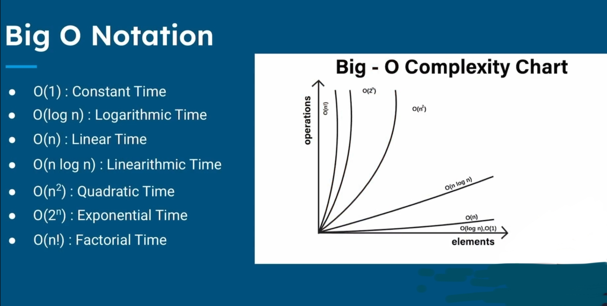
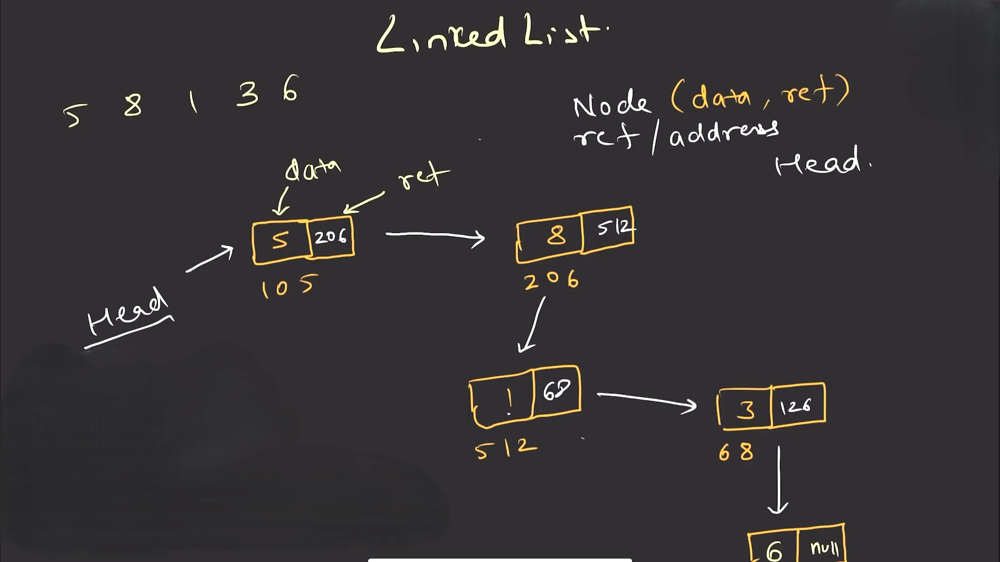

[](https://youtube.com/playlist?list=PLd3UqWTnYXOmx_J1774ukG_rvrpyWczm0&si=qNmC7PQ12HdXgpx-)
[](https://youtube.com/playlist?list=PL6Zs6LgrJj3tDXv8a_elC6eT_4R5gfX4d&si=SKzcEc7gIRpqCy8u)

</br>



---

# Linear Vs Binary - 🔍 Search - [Code](A01_Search.java)

```java
package com.akashdipmahapatra.DSA;

public class A_Search {

public static void main(String[] args){
    int arr[] = {5, 7, 9, 11, 13};
    int target = 11;

// Method
    int result_1 = linearSearch(arr, target);
    int result_2 = BinarySearch(arr, target);

//    output
    if(result_1 != -1) {
        System.out.println("Element found at Index: " + result_2);
    }else{
        System.out.println("Element not found");
    }
}
```
```java
public static int linearSearch(int[] arr, int target){
    int steps = 0; // To count the Steps (Optional)

    for(int i = 0; i<= arr.length; i++){
        steps++;
            if(arr[i] == target){
                System.out.println("Steps taken is Linear Search: " + steps);
                return i;
            }
        }
    return -1;
}
```
```java
public static int BinarySearch(int[] arr, int target){
// 5, 7, 9, 11, 13

    int steps = 0; // Optional
    int left = 0;
    int right = arr.length-1;

    while(left <= right){
        steps++;
        int mid = (left + right)/2;

        if(arr[mid] == target){
            System.out.println("Steps taken is Binary Search: " + steps);
            return mid;
        }else if(arr[mid] < target){
            left = mid+1;
        }else{
            right = mid-1;
        }
    }
    System.out.println("Steps taken is Binary Search: " + steps); // To cover all conditions.
    return -1;
}
```

## ❌ For loop not allow for "Divide-and-conquer" like Binary Search, Quick Sort, Marge Sort etc.

```java
// For loop not allow for "Divide-and-conquer" like Binary Search, Quick Sort, Marge Sort etc.

//    int left = 0;
//    int right = arr.length-1;
//
//    for(int i = left; i < right; i++){
//        int mid = (left + right)/2;
//
//        if(arr[mid] == target){
//            return mid;
//        }else if(arr[mid] < target){
//            left = mid + 1;
//        }else{
//            right = mid - 1;
//        }
//    }
//    return -1;
//}

}
```

## Binary Search 🔍 O(log n)


# Iterative Vs Recursive

> **No**, the binary search code I wrote and shared above is **not recursive** — it is **iterative**.

---

### 🔁 **Iterative Binary Search**

✅ Uses a `while` loop </br>
✅ Keeps updating `left` and `right` </br>
❌ Does **not** call itself (no recursion)

Previous code:

```java
while (left <= right) {
    int mid = (left + right) / 2;
    if (arr[mid] == target) return mid;
    else if (arr[mid] < target) left = mid + 1;
    else right = mid - 1;
}
```
---

### 🔁❌ Not Recursive Because:

* It does **not** do: `return BinarySearch(arr, newLeft, newRight, target)`
* It only loops — it doesn’t create a **stack of calls**

### [code](A02_Recursive.java)

```java
if(left<=right){
            int mid = (left + right)/2;

            if(arr[mid] == target){
                return mid;
            }else if(arr[mid] < target){
                return BinarySearch(arr, target, mid+1, right);
            }else{
                return BinarySearch(arr, target, left, mid-1);
            }
        }
```
---

## ❓ Which is Best ?

> Let's compare **Iterative vs Recursive Binary Search** in terms of **Data Structures and Algorithms (DSA)** — especially for **time complexity**, **space**, and **interview preference**.

---

## ✅ 1. **Time Complexity** – Same for Both

| Type                    | Best | Average  | Worst    |
| ----------------------- | ---- | -------- | -------- |
| Iterative Binary Search | O(1) | O(log n) | O(log n) |
| Recursive Binary Search | O(1) | O(log n) | O(log n) |

### 💡 Why O(log n)?

Because in every step, the search space is divided by 2.

---

## 🧠 2. **Space Complexity** – Different!

| Type          | Space Complexity                              |
| ------------- | --------------------------------------------- |
| **Iterative** | **O(1)** – Constant space (no extra memory) ✅ |
| **Recursive** | **O(log n)** – Due to recursion call stack ❌  |

### 🔥 Key Point:

Recursive Binary Search uses extra memory for **function call stack** (because each recursive call is stored until it's resolved). Iterative doesn’t.

---

## 🧪 3. **In Practice / Interviews / Exams:**

| Criteria              | Recommended           |
| --------------------- | --------------------- |
| **Performance**       | Iterative ✅           |
| **Memory Efficient**  | Iterative ✅           |
| **Shorter code**      | Recursive (sometimes) |
| **TCS DCA / NQT**     | Iterative ✅           |
| **Coding Interviews** | Iterative ✅           |

---

## 🧾 Final Verdict:

| Factor              | Winner                  |
| ------------------- | ----------------------- |
| Time Complexity     | ✅ Tie (Same)            |
| Space Efficiency    | ✅ Iterative             |
| Simplicity in logic | ❌ Recursive (but risky) |
| Industry/Exam use   | ✅ Iterative             |

---

### ✅ So, **Iterative Binary Search is better overall** for DSA practice, exams like **TCS NQT/DCA**, and coding interviews.


# Sorting 🔁

- Bubble Short -- O(n²) --> [Code](B01_Bubble_Sort.java)

```go
//After Shorting: 8 2 6 7 1
//                2 6 7 1 8
//                2 6 1 7 8
//                2 1 6 7 8
//                1 2 6 7 8 --> extra check --> So we need Selection Short
//                1 2 6 7 8 --> "
```

- Selection Short


- Insertion Sort
> It's actually not `Swapping` but actully `Shifting`. completely take out all values and put into the array again in right order. </br></br>
> Visualizer websites [`link1` with problems](https://www.hackerearth.com/practice/algorithms/sorting/insertion-sort/visualize/), [`Link2`](https://yongdanielliang.github.io/animation/web/InsertionSortNew.html)

---


# Linked List


